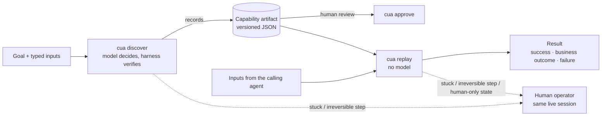
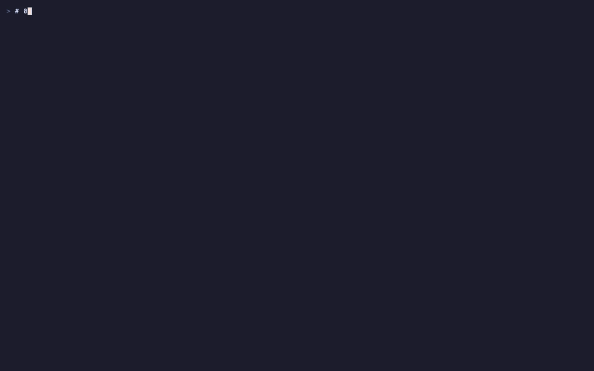
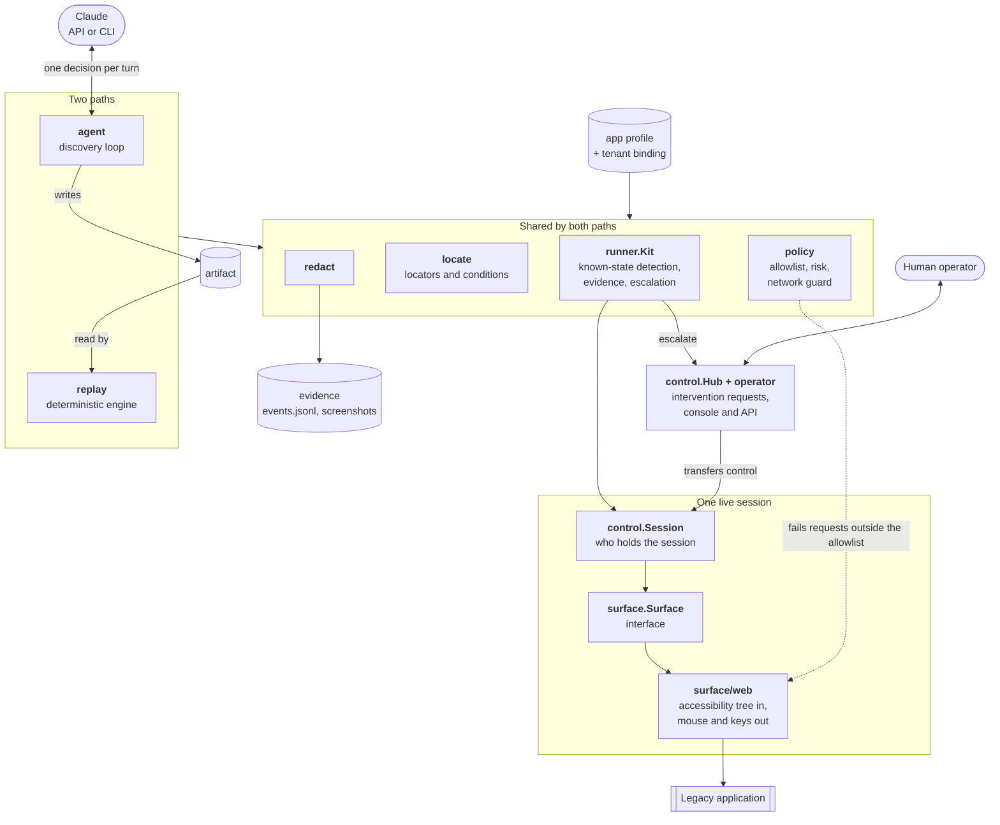
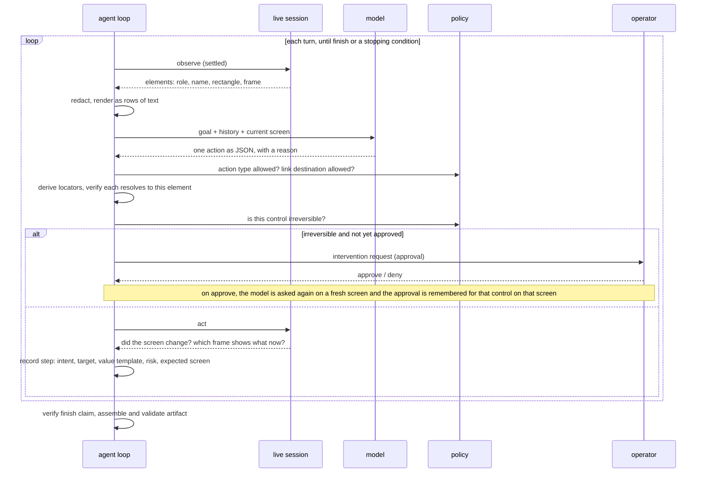
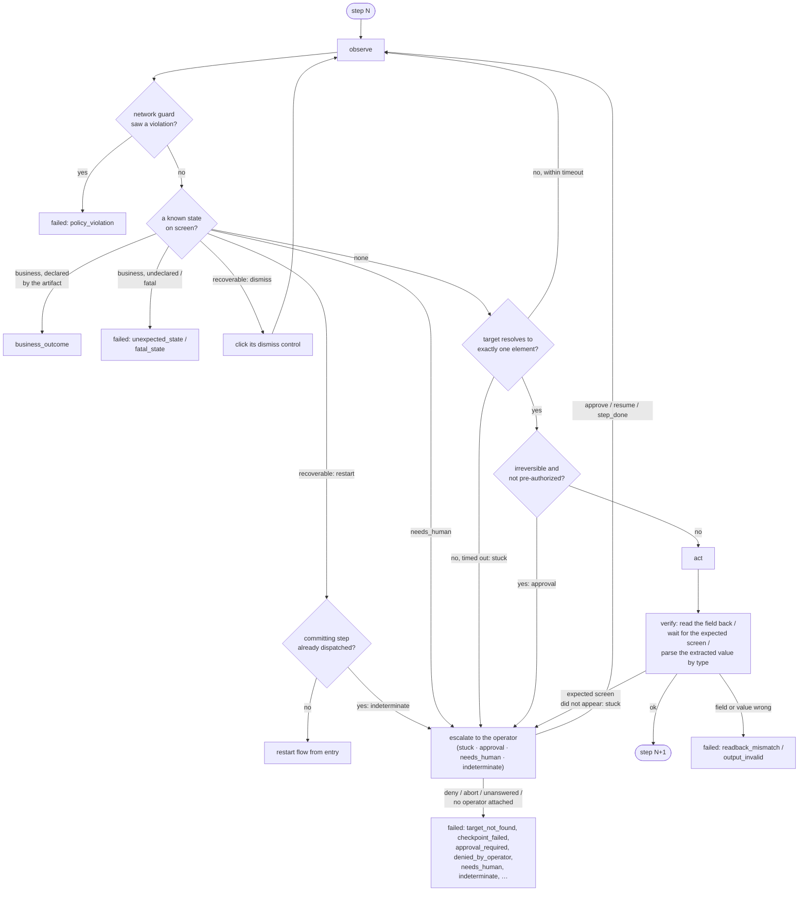
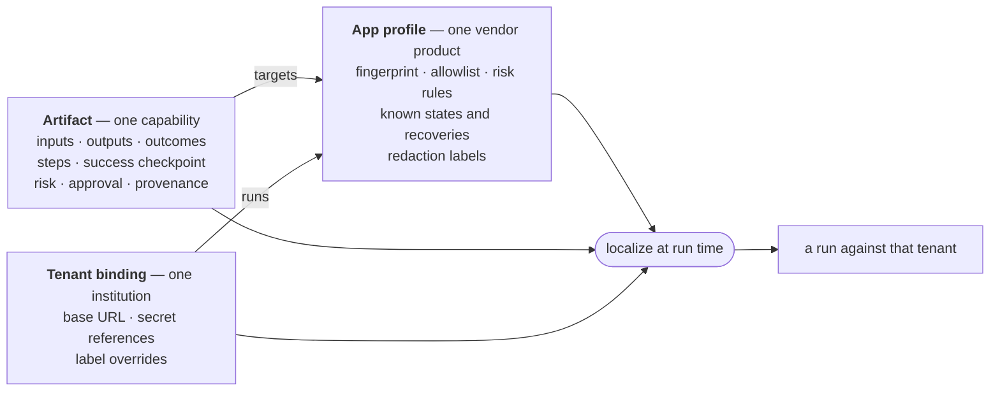
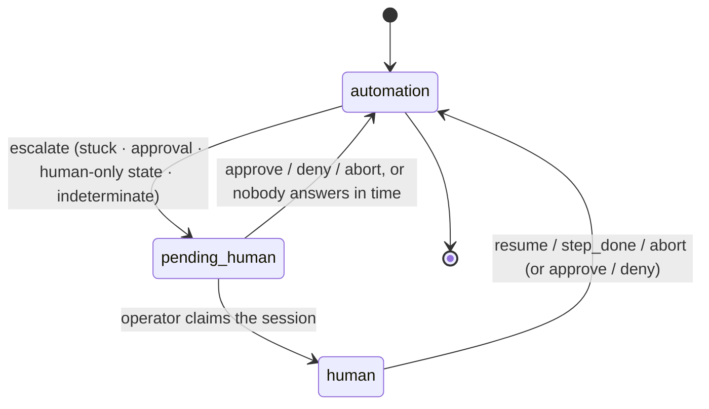
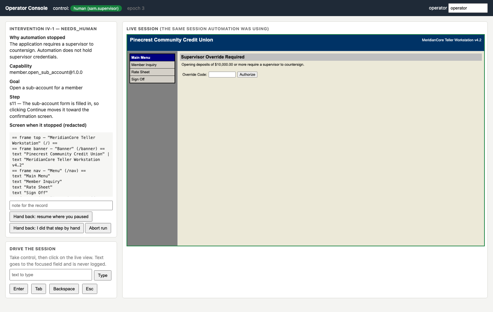
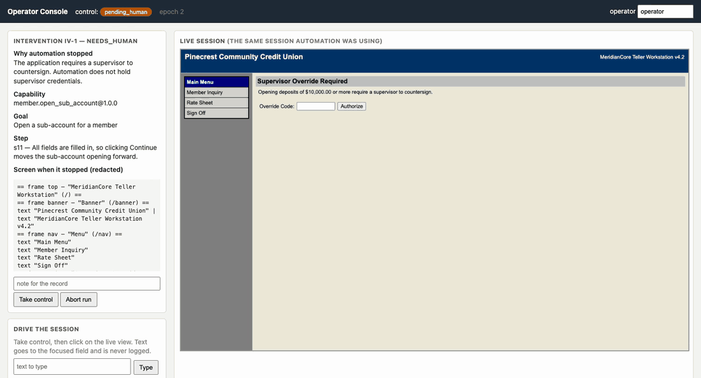

# rote

*To learn a thing once, then perform it by rote.*

A model works out **once** how to do a task inside a legacy back-office application.
What it learned is saved as a typed, reviewable **capability artifact**.
From then on an AI agent invokes that capability through **deterministic replay** — no model in the loop — and gets back a structured result. When the system cannot safely continue, a **human operator takes control of the same live session** and hands it back.

Written in Go. The requirements and their traceability are in [docs/SPEC.md](docs/SPEC.md); the design write-up is in [REPORT.md](REPORT.md); recorded runs are in [evidence/](evidence/); recordings of the demo path and of the operator console are embedded below (MP4 versions in [docs/](docs/)).



## Contents

- [What is in the box](#what-is-in-the-box)
- [Setup](#setup)
- [Demo path](#demo-path)
- [How it works](#how-it-works)
- [The result contract](#the-result-contract)
- [Human handoff](#human-handoff)
- [Safety](#safety)
- [Second tenant, same artifact](#second-tenant-same-artifact)
- [Agent-facing catalog](#agent-facing-catalog)
- [Tests](#tests)
- [Repository map](#repository-map)
- [What is mocked](#what-is-mocked)

## What is in the box

| Piece | What it is |
|---|---|
| `bin/cua` | The system: `discover`, `replay`, `approve`, `describe`, `capabilities`, `operator`. |
| `bin/legacybank` | The target application: a simulated legacy core-banking teller workstation ("MeridianCore"). Frameset, nested layout tables, no ids or test ids, unlabelled form fields, clickable table cells, a native confirm dialog. All data is synthetic. |
| `artifacts/` | Two capabilities recorded by real model-driven runs: a read (`member.get_savings_balance`) and a write with a committing step (`member.open_sub_account`). |
| `profiles/`, `tenants/` | What is known about the product (shared by all tenants) and what differs per institution. |
| `evidence/` | Logs, screenshots and results from two discovery runs and eight replay scenarios. |

## Setup

Requirements: **Go 1.26+** (an older Go 1.21+ toolchain fetches it automatically) and **Chrome or Chromium** installed. The browser is driven over the DevTools protocol; there is nothing else to install. `jq` is handy for reading the evidence but nothing depends on it. For `cua discover` you also need model access: either `ANTHROPIC_API_KEY` or a logged-in `claude` CLI (next section).

```bash
make build                 # builds bin/cua and bin/legacybank
cp .env.example .env       # simulator demo credentials; add a model key here if you have one
make sim                   # starts two tenant simulators: 127.0.0.1:8080 and :8081
```

`.env` is gitignored and read by `cua` on start. It holds the operator credentials each tenant binding refers to (the simulator's built-in demo credentials, not real ones) and, optionally, `ANTHROPIC_API_KEY`.

Run every command from the repository root: `.env` is read from the current directory. Note that `cua discover` and `cua approve` rewrite the artifact files under `artifacts/`, which are committed; `git checkout artifacts/` restores the recorded ones.

**Model access is needed only for `cua discover`.** Two backends produce the same decisions through the same agent loop:

| Backend | Selected when | Needs |
|---|---|---|
| `anthropic` (recorded as `anthropic-api`) | `ANTHROPIC_API_KEY` is set (or `--backend anthropic`) | an API key; uses the official Go SDK with structured outputs |
| `claude-cli` | no key is set (or `--backend claude-cli`) | the `claude` CLI, logged in; used as a plain model endpoint with tools disabled |

Both feed the same agent loop with the same prompt and schema; the evidence was produced with `claude-cli`. The default model is `claude-opus-5-5` (`--model` to change). Discovery stops after 30 turns or 10 minutes (`--max-turns`, `--timeout`); an intervention waits up to 10 minutes for an operator (`--operator-timeout`).

**Running without any live service.** Replay, the operator handoff, and the whole test suite need no model and no network: they run against the local simulator using the committed artifacts. Skip step 1 of the demo and start at step 2.

## Demo path

Exactly what follows, recorded (4 min: build, discovery, review, replays, injected faults, a hard failure, the handoff driven from the command line, the second tenant). Video version: [docs/demo.mp4](docs/demo.mp4).



```bash
# 1. Discover: give the goal in plain language; the model drives the live application
#    to accomplish it (about 40 s). The value named in the sentence becomes the
#    capability's input (--input), and the output to extract is declared (--output).
./bin/cua discover --tenant tenants/pinecrest.json \
    --goal "Look up member 10042 and read their current savings balance" \
    --id member.get_savings_balance --input member_id=10042 --input-pattern 'member_id=^[0-9]{1,10}$' \
    --output savings_balance:money:sensitive
#    -> writes artifacts/member.get_savings_balance.json and evidence under runs/<run id>/
#    A richer contract (enum or sensitive inputs, several outputs) is written as a request
#    file instead: --goal goals/open_sub_account.json (see goals/).

# 2. Review what was recorded, as a human would before approving it.
./bin/cua describe --artifact artifacts/member.get_savings_balance.json

# 3. Replay it for a different member. No model is involved (under 1 s).
./bin/cua replay --artifact artifacts/member.get_savings_balance.json \
    --tenant tenants/pinecrest.json --input member_id=10058

# 4. Replay with an input that has no record: a business outcome, not an error.
./bin/cua replay --artifact artifacts/member.get_savings_balance.json \
    --tenant tenants/pinecrest.json --input member_id=99999
```

Step 3 prints the result the calling agent receives (abridged; the run log is echoed to stderr):

```json
{
  "status": "success",
  "capability": "member.get_savings_balance",
  "version": "1.0.0",
  "tenant": "pinecrest",
  "outputs": { "savings_balance": "18902.44" },
  "steps_completed": 7,
  "steps_total": 7,
  "attempts": 1,
  "duration_ms": 863
}
```

Step 4 (abridged):

```json
{
  "status": "business_outcome",
  "outcome": {
    "code": "record_not_found",
    "message": "No member found matching number 99999.",
    "at_step": "s6"
  }
}
```

Exit codes: `0` success, `3` business outcome, `1` failure, `2` usage or configuration error.

More scenarios. The simulator's `/_sim/fault` control plane injects runtime conditions: `after=N` lets N main-frame requests through before the condition fires once.

```bash
# Recoverable conditions: an interstitial, a session expiry mid-flow, a slow page.
curl -s -XPOST localhost:8080/_sim/fault -d kind=notice -d after=1
curl -s -XPOST localhost:8080/_sim/fault -d kind=expire -d after=3
curl -s -XPOST localhost:8080/_sim/fault -d kind=slow   -d after=7 -d delay_ms=3500
./bin/cua replay --artifact artifacts/member.get_savings_balance.json \
    --tenant tenants/pinecrest.json --input member_id=10042
#   -> success, with "recoveries": system_notice/dismiss, session_expired/restart, slow_response/waited

# Hard failure: member 10063 has no savings share and the artifact declares no outcome for that.
./bin/cua replay --artifact artifacts/member.get_savings_balance.json \
    --tenant tenants/pinecrest.json --input member_id=10063
#   -> failed / target_not_found, with the step, what was expected, what was on screen, and a screenshot
```

`./scripts/evidence.sh` runs every scenario in order and rewrites `evidence/`; [evidence/README.md](evidence/README.md) indexes what each run shows.

## How it works

### Components



Nothing above `surface.Surface` knows about HTML, the DOM or the DevTools protocol. The surface reports a flat list of what an operator could see — role, name, value, rectangle, frame — and accepts clicks and keystrokes. That is the seam a desktop adapter would plug into.

### Discovery: the model proposes, the harness disposes



Things the model never does: see a secret (it writes `{{secrets.operator_password}}`), see a masked value (it points at the element; the harness reads it), choose a locator, or decide that a step is safe. Stopping conditions: goal reached, the model reports a dead end, turn budget, time budget, or three consecutive rejected/ineffective actions ("stuck", which escalates to a human if one is attached).

### Replay: one step



Waiting for the expected screen runs the same guard and state checks, so "not found" appearing after a search is reported as itself, not as a timeout. Every wait is bounded by the step timeout (10 s by default, polled every 200 ms); a dismissed or restarted condition is bounded by the profile's `max_attempts` for that state, and the whole flow by two restarts. After the last step the success checkpoint is verified and every declared output must be present before anything is called a success. Any "abort" from an operator ends the run as `aborted_by_operator`.

### Artifact, profile, tenant



An artifact is recorded once per product, not per tenant. `cua describe --artifact …` prints it as a review sheet; the JSON itself is in `artifacts/`.

## The result contract

| `status` | Meaning | Caller should |
|---|---|---|
| `success` | Every step ran, the checkpoint held, `outputs` are attached. | use the outputs |
| `business_outcome` | The application gave a legitimate answer that is not the happy path. `outcome.code` is one of the codes the artifact declares (`record_not_found`, `validation_error`, `permission_denied`). | handle the code; do not retry |
| `failed` | The run could not be completed. `failure` has `kind`, `message` and `irreversible_step_dispatched`, plus — whenever the failure happened on a step with the application open — `step`, `expected`, `observed`, a screenshot and an observation snapshot. | inspect; retry only if nothing was committed |

Whatever the status, the result also reports `recoveries` (conditions the engine got past: a dismissed interstitial, a restart after session expiry or a server error, a slow response), `drift` (steps where the primary locator no longer matched and a fallback was used), and `handoffs` (every answered human intervention, with what the person did).

Failure kinds are listed in [`internal/replay/result.go`](internal/replay/result.go).

## Human handoff

Pass `--operator 127.0.0.1:8090` to `discover` or `replay` and the process serves a minimal operator console at that address (loopback only; it has no authentication). Without the flag there is no one to ask, and the same situations end as clean failures.





The console in use for the handoff below — take control, enter the override code on the live view, hand back, then approve the committing step (`cmd/consolerec` drives the page and records it; video version: [docs/console.mp4](docs/console.mp4)):



At most one party holds the session at a time (while a request is pending, nobody does); every action is checked against the holder, and every transfer is logged with an incrementing epoch. The timeout applies only while nobody has claimed; an operator who has taken the session keeps it until they hand it back. While a human holds it, they drive the *same* browser session through the console (click on the live view, type, press keys); what they do is recorded (element clicked, number of characters typed — never the text).

Try it: an opening deposit of $10,000 or more makes the application demand a supervisor override code that automation does not have.

```bash
./bin/cua replay --artifact artifacts/member.open_sub_account.json --tenant tenants/pinecrest.json \
    --operator 127.0.0.1:8090 \
    --input member_id=10058 --input "account_type=Money Market" \
    --input nickname=Reserve --input opening_deposit=12000.00
```

Open <http://127.0.0.1:8090/>, put your name in the **operator** box, press **Take control**, click the Override Code field in the live view, type `SUP-4471` in the text box and press **Type**, click **Authorize**, then **Hand back: resume where you paused**. Replay verifies the screen it was waiting for, continues, and stops once more to ask approval for the committing step; press **Approve**.

The same API is scriptable, which is how the evidence run was produced. In a second terminal, while the replay above is running:

```bash
./bin/cua operator wait
./bin/cua operator claim   --as sam.supervisor
./bin/cua operator click   --as sam.supervisor --x 340 --y 142      # the Override Code field (the adapter's viewport is fixed at 1280x900, so these hold)
./bin/cua operator type    --as sam.supervisor --text SUP-4471
./bin/cua operator click   --as sam.supervisor --x 431 --y 142      # Authorize
./bin/cua operator resolve --as sam.supervisor --action resume
./bin/cua operator wait                                             # the approval request for "Confirm"
./bin/cua operator resolve --as sam.supervisor --action approve
```

## Safety

- **Allowlist.** `profiles/meridian-core.json` lists permitted paths and action types; the tenant binding supplies the origin. Two layers enforce it: per action, the action type is checked on both paths and, during discovery, a link's destination as well; at the network layer, every request the browser makes — navigation, frame load, form post — is failed before it leaves if its origin or path is outside the allowlist. The simulator's own control plane (`/_sim/`) is outside it.
- **Irreversible steps.** A click is irreversible if the control's name matches the profile's risk rules, and the requests that actually commit (`POST /subaccount/confirm`) are held at the network layer unless a step was authorized — one authorization releases one committing request, whichever click sends it (here the native dialog's OK). During discovery such a step always needs an operator's approval. During replay it needs an operator's approval unless the artifact is approved (`cua approve`) **and** the caller passes `--authorize-irreversible`. Once a committing request has gone out, the flow is never restarted and the step is never repeated.
- **Sensitive data.** Secrets are referenced by name and resolved from the environment at the moment of typing; they never reach the model, the artifact or the log. One redactor sits in front of the model, the run log, saved observations and screenshots: it masks by pattern (SSN, card, phone, email, dollar amounts, plus product-specific patterns from the profile), by label (the value next to "SSN/TIN:", "Member Name:" …) and by literal (every secret and sensitive input/output of the run, of four characters or more). Discovery refuses to save an artifact that contains a concrete input or secret value.

```bash
./bin/cua approve --artifact artifacts/member.open_sub_account.json --by "reviewer name"
./bin/cua replay --artifact artifacts/member.open_sub_account.json --tenant tenants/pinecrest.json \
    --authorize-irreversible \
    --input member_id=10058 --input "account_type=Holiday Club" \
    --input nickname=Gifts --input opening_deposit=75.00
```

## Second tenant, same artifact

`make sim` also starts "Lakeshore" on port 8081: the same product on a newer minor release (same profile), different branding, and different wording for three labels. The artifact recorded on Pinecrest runs there unchanged, because the tenant binding maps the product's canonical labels to Lakeshore's:

```bash
./bin/cua replay --artifact artifacts/member.get_savings_balance.json \
    --tenant tenants/lakeshore.json --input member_id=10042        # success

./bin/cua replay --artifact artifacts/member.get_savings_balance.json \
    --tenant tenants/lakeshore-unmapped.json --input member_id=10042
#   -> the menu item "Member Inquiry" is not found; the positional fallback happens to click the right cell (reported under "drift"),
#      then the step's checkpoint fails on the relabelled screen title: failed / checkpoint_failed, nothing clicked through
```

## Agent-facing catalog

```bash
./bin/cua capabilities      # every artifact as a tool definition: name, description, JSON Schema for inputs, outputs, outcome codes, risk, approval
```

## Tests

```bash
make test        # everything; the end-to-end tests drive headless Chrome against the simulator and skip if Chrome is missing
make test-unit   # no browser
```

The end-to-end suite replays both committed artifacts against the simulator across the result contract: outcomes, recoveries, policy violations, handoffs, the second tenant, and the rule that a committing step is never retried. The engine and the discovery loop also have browser-free tests over an in-memory surface with a scripted model. No test needs a real model or a network.

## Repository map

```
cmd/cua/                 CLI
cmd/legacybank/          simulator entry point
internal/surface/        the perception/action seam: Element, Observation, Surface
internal/surface/web/    browser adapter: accessibility tree over CDP, synthesized input, request gate
internal/surface/fake/   in-memory surface used by the engine and agent tests
internal/locate/         locators (name, label, grid, ordinal), derivation, conditions
internal/capability/     artifact schema, app profile, tenant binding, localization, typed values
internal/policy/         allowlist, risk classification, network guard
internal/redact/         masking for model input, logs, observations, screenshots
internal/evidence/       run log and evidence files
internal/control/        control token, intervention requests, handoff
internal/operator/       operator console (HTML) and API
internal/runner/         what discovery and replay share
internal/agent/          discovery loop and recorder
internal/replay/         replay engine and result contract
internal/llm/            model backends
internal/legacybank/     the simulated legacy application
internal/e2e/            end-to-end tests
profiles/ tenants/ goals/ artifacts/ evidence/ scripts/
docs/                    SPEC.md, demo recording (demo.gif/.mp4 from demo.tape via vhs), console recording (console.gif/.mp4) and screenshot
cmd/consolerec/          records the console recording; not part of the product
```

## What is mocked

| Mocked | Real |
|---|---|
| The target application (a local simulator; no real bank system was used) | The browser session, the accessibility-tree perception, the input events |
| The operator console UI (one bare HTML page) and operator identity (a free-text name, no authentication; the server refuses to bind anything but loopback) | The control token, the intervention request, driving the same live session, handing back, the record of human actions |
| Secret storage (environment variables) | Secrets never reaching the model, artifact or logs |
| Desktop and other surfaces (interface only) | The web surface |
| Multi-tenant storage and rollout (files in a directory) | One artifact running against two differently configured tenants |
